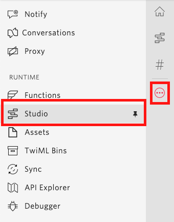
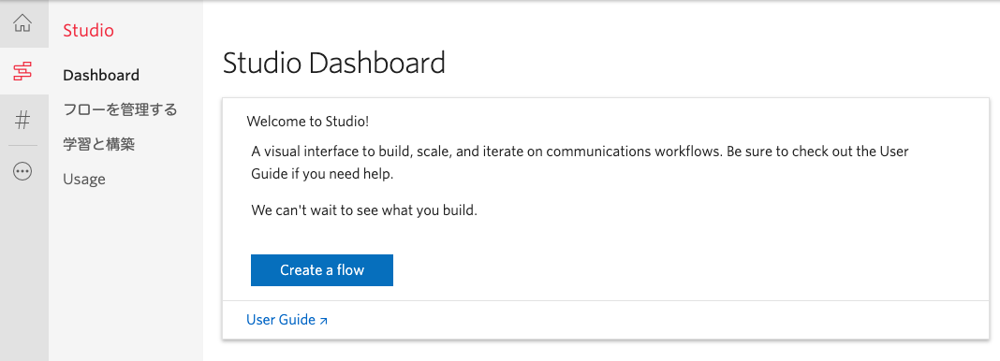
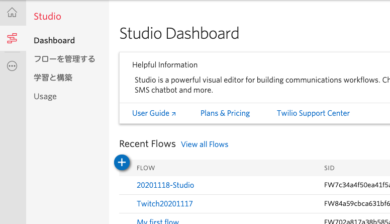
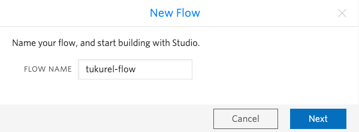
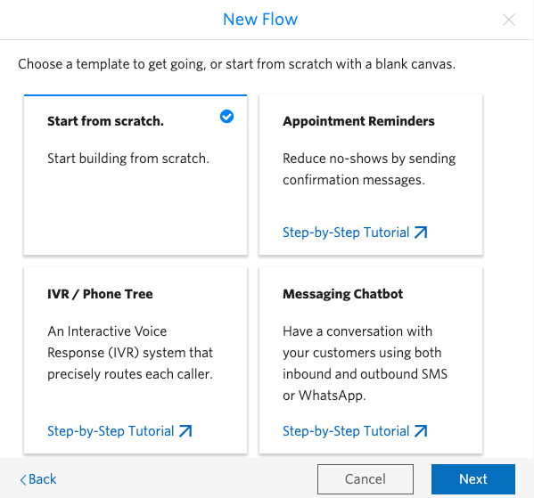
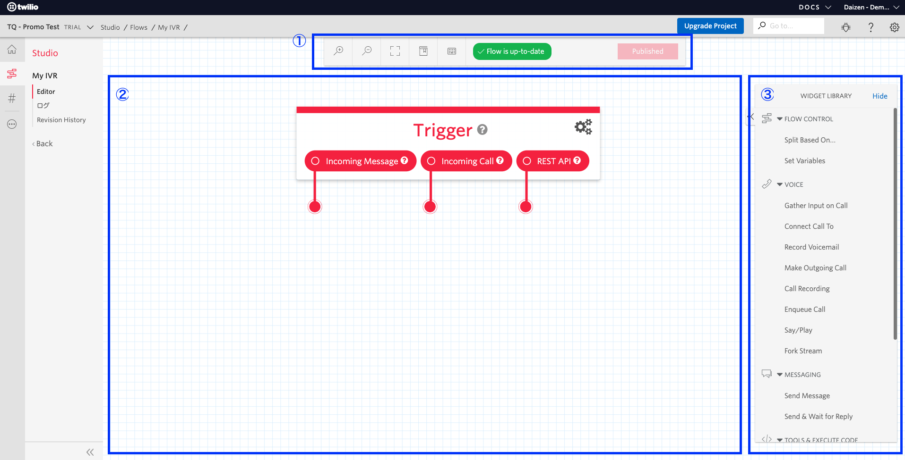

#  手順1: 新しいコールフローの作成

この手順では、Twilio Studioを用いて新しいフローを作成する方法を学びます。

## 前提条件
Twilioアカウントが必要になります。事前に案内されたリンク、または下記の記事を参考にアカウントを作成してください。  
[Twilioアカウントの作成方法](https://www.twilio.com/blog/how-to-create-twilio-account-jp)

## 1-1. Studioフローの新規作成

[Twilioコンソール](https://jp.twilio.com/console)にサインインし、画面左のナビゲーションから[Studio](https://jp.twilio.com/console/studio)を選択します。

[Studioダッシュボード](https://jp.twilio.com/console/studio/dashboard)が表示されます。初めてフローを作成する場合は`Create a flow`ボタンをクリックします。以前に作成したことがある場合は既存のフロー一覧が表示されている状態で`+`ボタンをクリックします。

- 初めてフローを作成する場合  

- 既存のフローが存在する場合  

フローの名前を設定します。わかりやすい名前をつけ、`Next`ボタンをクリックします。

いくつかテンプレートが表示されますが、このハンズオンではフルスクラッチで作成するため`Start from scratch`を選択し、`Next`ボタンをクリックします。

初期化が完了するとデザイン画面が表示されます。デザイン画面には大きく分けて3つの領域が用意されています。

|領域の番号 |説明 |
|:-------:|:--------|
|1|デザインキャンバスの操作およびフローの公開を制御|
|2|デザインキャンバス、ここにウィジェットを配置する |
|3|ウィジェットライブラリ、アクションやフロー制御を行う __部品__ が準備されている |

これらを利用しフローを作成します。
今回はここまでとなりますが、各ウィジェットの説明を下記で確認できます。

-------------------------------------

### 各ウィジェットの概要

|イメージ|ウィジェットの名前 |種類 |説明 |
|:-------:|:-------:|:--------|:--------|
||[Trigger](https://jp.twilio.com/docs/studio/widget-library/trigger-start)|Flow Control|フローの開始となるウィジェット|
||[Split Based On...](https://jp.twilio.com/docs/studio/widget-library/split-based-on)|Flow Control|フローの分岐を指定できるウィジェット |
||[Set Variables](https://jp.twilio.com/docs/studio/widget-library/set-variables)|Flow Control|フロー内で入力された内容を保持できる変数を設定できるウィジェット|
||[Gather Input On Call](https://jp.twilio.com/docs/studio/widget-library/gather-input-call)|VOICE|ユーザーからの入力を受け取るウィジェット|
||[Connect Call To](https://jp.twilio.com/docs/studio/widget-library/connect-call)|VOICE|通話を別の番号、ユーザーに転送するウィジェット|
||[Make Outgoing Call](https://jp.twilio.com/docs/studio/widget-library/make-outgoing-call)|VOICE|外部発信を行うウィジェット|
||[Record Voicemail](https://jp.twilio.com/docs/studio/widget-library/record-voicemail)|VOICE|ボイスメールの録音を行うウィジェット|
||[Call Recording](https://jp.twilio.com/docs/studio/widget-library/call-recording)|VOICE|通話録音を開始または終了するウィジェット|
||[Enqueue Call](https://jp.twilio.com/docs/studio/widget-library/enqueue-call)|VOICE|現在の通話をコールキューに挿入するウィジェット|
||[Say/Play](https://jp.twilio.com/docs/studio/widget-library/sayplay)|VOICE|テキストまたは音声ファイルを再生するウィジェット|
||[Fork Stream](https://jp.twilio.com/docs/studio/widget-library/fork-stream)|VOICE|現在の通話のオーディオストリームをWebsocket/SIPRECプロトコロルで送るウィジェット|
||[Send Message](https://jp.twilio.com/docs/studio/widget-library/send-message)|MESSAGING|メッセージを送信するウィジェット|
||[Send & Wait for Reply]()|MESSAGING|メッセージを送信し、返信を待つウィジェット|
||[Run Function](https://jp.twilio.com/docs/studio/widget-library/run-function)|TOOLS & EXECUTE CODE|Twilio Functionを呼び出すウィジェット|
||[Make HTTP Request](https://jp.twilio.com/docs/studio/widget-library/http-request)|TOOLS & EXECUTE CODE|外部サービスやアプリケーションにHTTPリクエストを送信するウィジェット|
||[Add TwiML Redirect](https://jp.twilio.com/docs/studio/widget-library/twiml-redirect)|TOOLS & EXECUTE CODE|フローの外部に処理を渡すウィジェット|
||[Send to Autopilot](https://jp.twilio.com/docs/studio/widget-library/autopilot)|CONNECT OTHER PRODUCTS|AutoPilotに通話やメッセージを送信するウィジェット|
||[Send to Flex](https://jp.twilio.com/docs/studio/widget-library/send-flex)|CONNECT OTHER PRODUCTS|通話やメッセージをFlexに転送するウィジェット|

-------------------------------------

次の手順では`Say/Play`ウィジェットを用いて基本的なフローを設定します。

## 関連リソース

- [Twilio Stduioユーザーガイド](https://jp.twilio.com/docs/studio/user-guide)

## 次の手順
[手順2: ウィジェットをフローに追加](02-Use-Widgets.md)
