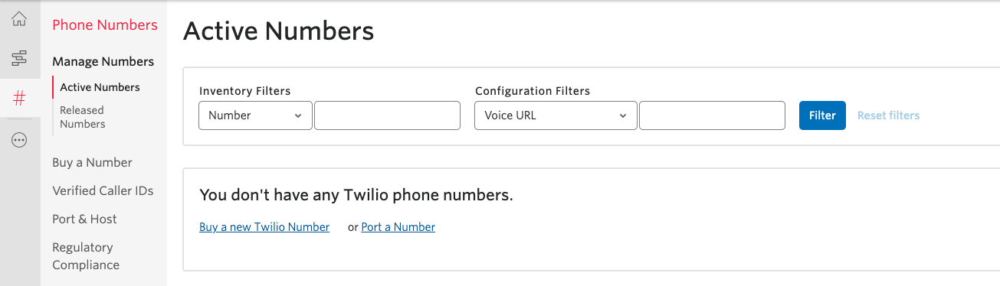
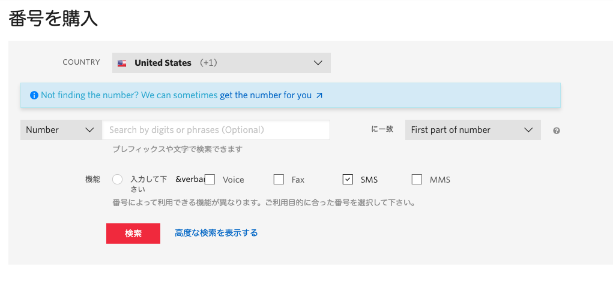
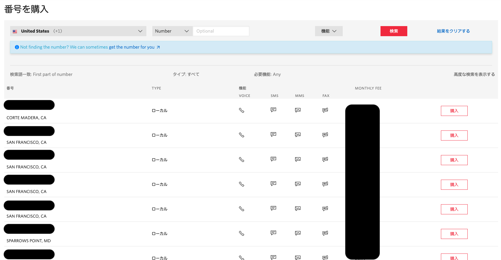
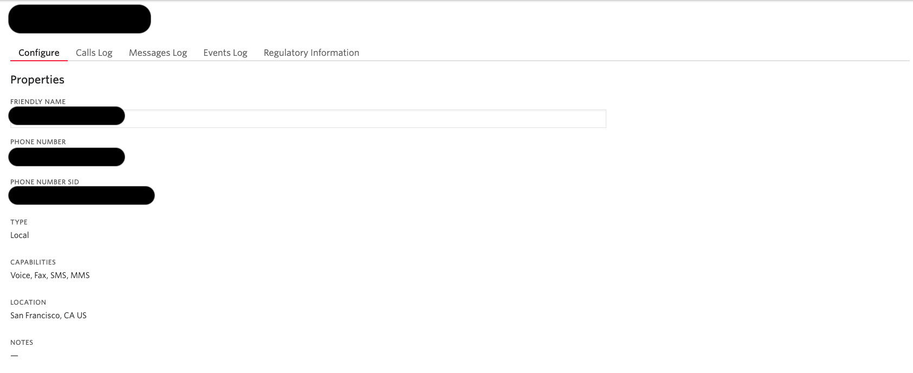
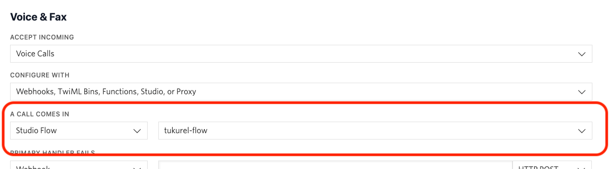

#  手順3: 電話番号に接続

この手順では、Studioで作成したお悩み相談フローを電話番号に接続する方法を学習します。

## 3-1. 電話番号を取得

最初にフローを接続するTwilioが提供する電話番号を取得します。Twilio番号をすでに持っている場合はこの項目をスキップしてください。

[Twilioコンソール](https://jp.twilio.com/console/phone-numbers/incoming)を開き`Buy a new Twilio Number`リンクをクリックします。

次の画面で購入可能な電話番号を検索できます。日本の番号を取得する場合、免許証やパスポートを用いた本人確認作業が発生します。本人確認のプロセスを終えていない場合は米国の電話番号を取得しましょう。

また、電話番号を購入する場合、回線維持料金が必要になります。国、電話番号の種類により料金が変わります。ただしトライアルアカウントの場合、無料クレジットが使用されるため心配はありません。

`COUNTRY`をUnited Stats、`検索`ボタンをクリックします。

購入可能な番号一覧が表示されます。好きな番号を選び、`購入`ボタンで購入してください。

## 3-2. 電話にフローを接続

電話番号を購入した場合、直後にその番号の設定画面が表示されます。

すでに番号を持っている場合は、[アクティブな電話番号ページ](https://jp.twilio.com/console/phone-numbers/incoming)で表示される電話番号をクリックします。

設定画面の`Voice & Fax`セクションの`A CALL COMES IN`項目を設定します。
最初のドロップダウンで`Studio Flow`を選択し、次のドロップダウンで先ほど作成したフローを選択します。

忘れずに`Save`ボタンをクリックしましょう。

## 3-3. Let's Test

それではこの番号に電話をかけてみましょう。トライアルアカウントを利用している場合は、最初に英語でトライアルアカウントである次のメッセージが流れます。このメッセージはスキップできないので最後まで聴いてください。

> You have a trial account. You can remove this message at anytime by upgrading to full account. Press any to execute your code.

音声が再生されたあとにいずれかの番号を押すと先ほど作成したフローが開始されます。設定通りに音声が再生されたでしょうか。次のハンズオンではお悩み相談のフローを構築します。

## 関連リソース

- [Twilio CLI Quickstart](https://www.twilio.com/docs/twilio-cli/quickstart)

## 次のハンズオン

[ハンズオン: 相談員とAI、あなたはどちら](/docs/02-Split-Flow/00-Overview.md)