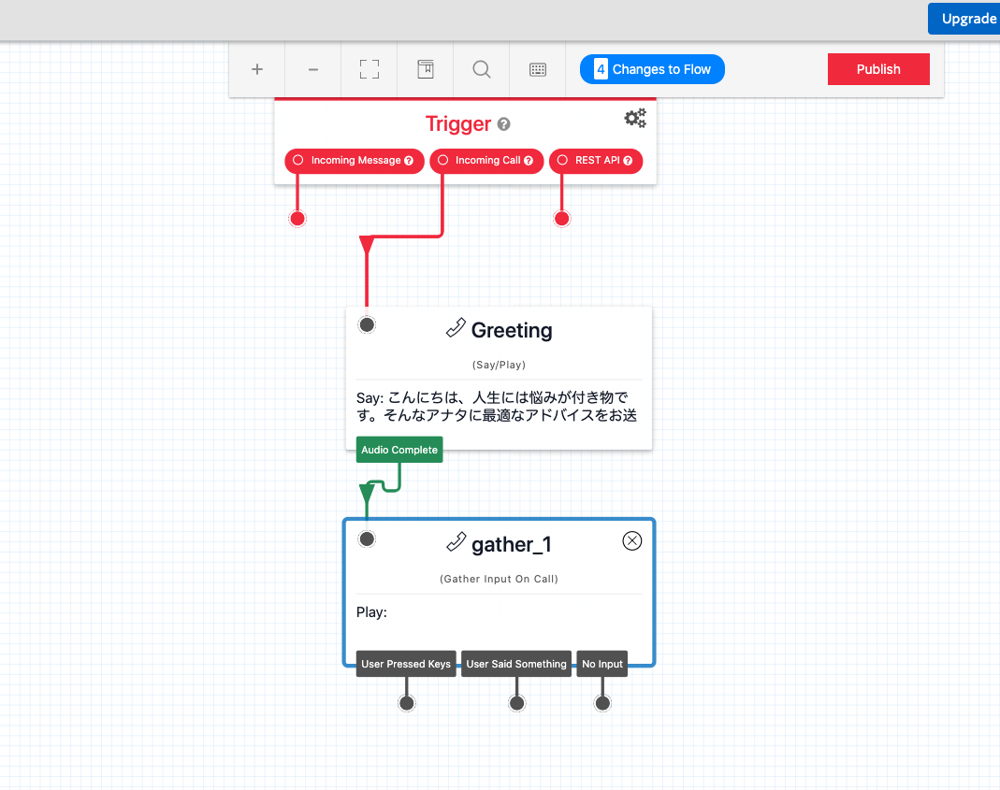
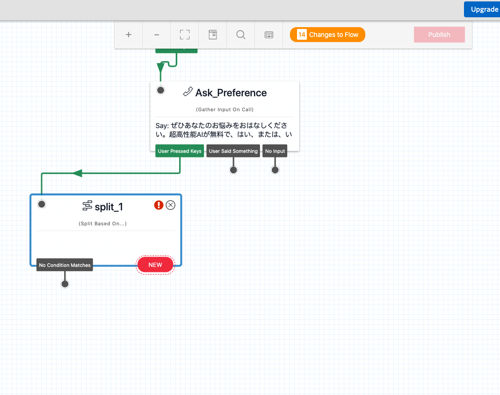
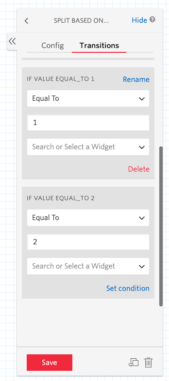
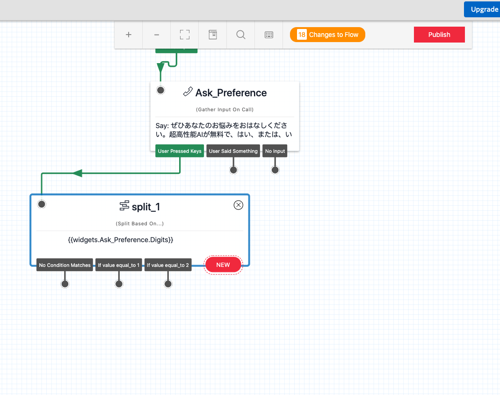
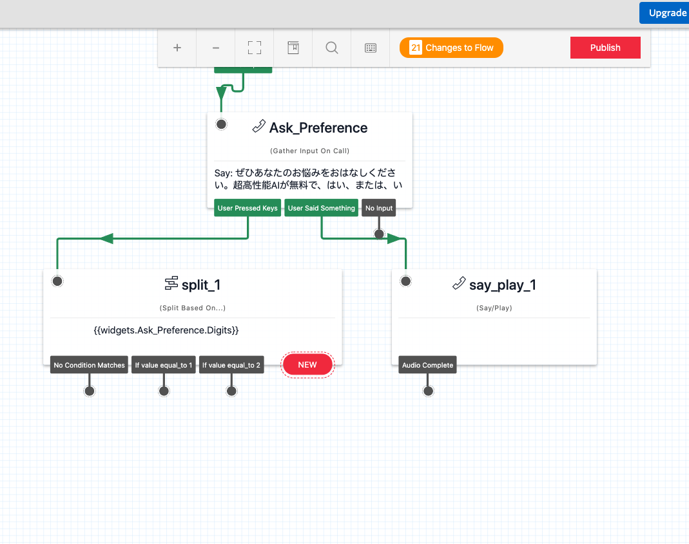
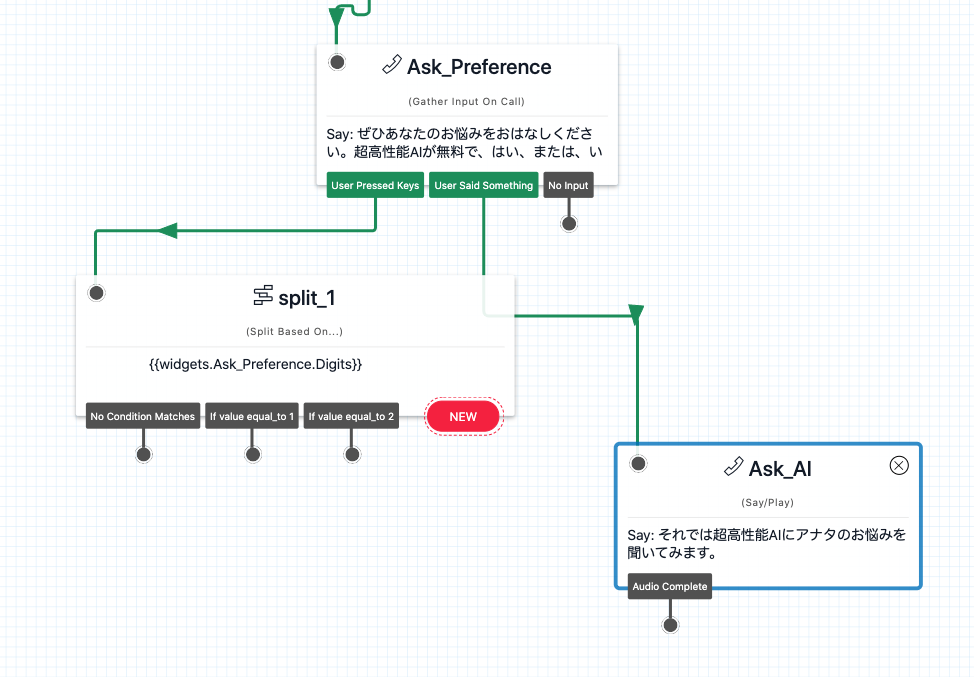

#  手順1: 相談者の入力を取得し、フローを分岐させる

この手順では、相談者の入力を取得しその内容をもとにフローを分岐させます。

## 1-1. Gather Input on Call ウィジェットを追加する

`Gather Input on Call`ウィジェットを追加し、先ほど設定した`Greeting`の`Aduto Complete`と接続します。このウィジェットはメッセージを流すだけでなく、キーの入力や音声入力を取得できます。

このウィジェットの`Congfig`設定を次のように設定します。

|設定項目|値|
|:----|:----|
|WIDGET NAME| Ask_Preference |
|TEXT TO SAY| ぜひあなたのお悩みをおはなしください。超高性能AIが無料で、はい、または、いいえ、でお答えします。もし、経験豊富なカウンセラーにご相談されたい場合は、1 を押してください。テンションが上がる曲をお聴きになりたい場合は 2 を押してください。|
|LANGUAGE|Japanese|
|MESSAGE VOICE| Alice、\[Polly\] Mizuki、\[Polly\] Takumiのいずれか|
|STOP GATHERING AFTER （DIGITSのほう）|1|
|SPEECH RECOGNITION LANGUAGE|Japanese (Japan)|
  

## 1-2. 選択に合わせてフローを分岐

先ほどのウィジェットで相談者は3つの選択肢が与えられました。

1. 超高性能AI（笑）に相談する
2. 経験豊富なカウンセラーに相談する
3. テンションが上がる曲をきいて悩みを吹き飛ばす

コールフローもこの選択肢に合わせて分岐させます。

フローを分岐させる場合は`Split Based On...`ウィジェットを使用します。このウィジェットを追加し、`Ask_Preference`ウィジェットの`User Pressed Keys`と接続します。

`split_1`ウィジェットの`Config`設定を次のように変更します。

|設定項目|値|
|:----|:----|
|VARIABLE TO TEST| widgets.Ask_Preference.Digits |

続けて`split_1`ウィジェットの`Transitions`設定を開き、`NEW Condition`の`+`ボタンで分岐を2つ作成します。それぞれ、条件を`Equal To` - `1`、`Equal To` - `2`と設定します。下記のスクリーンショットを参考にしてください。

ここまでのステップでデザインキャンバスは下記のようになっています。

これでキーを押したシナリオの分岐が設定できました。超高性能AI（笑）に接続するフローはユーザーが何かを話した時に限定されるため、別の接続を使います。

## 1-3. 音声入力がある場合のフローを設定

現在のフローに`Say/Play`ウィジェットをさらに追加します。追加したウィジェットと`Ask_Preference`ウィジェットの`User Said Something`を接続します。

追加した`Say/Play`ウィジェットを次のように設定します。

|設定項目|値|
|:----|:----|
|WIDGET NAME| Ask_AI |
|TEXT TO SAY| それでは超高性能AIにアナタのお悩みを聞いてみます。|
|LANGUAGE|Japanese|
|MESSAGE VOICE| Alice、\[Polly\] Mizuki、\[Polly\] Takumiのいずれか|

超高性能AI（笑）と連携する部分はのちほど構築します。

ここまで設定すると次のようなフローになっています。

## 関連リソース

- [Twilio CLI Quickstart](https://www.twilio.com/docs/twilio-cli/quickstart)

## 次の手順
[手順2: 分岐したフローをそれぞれ設定する](02-Setting-Wdigets.md)
