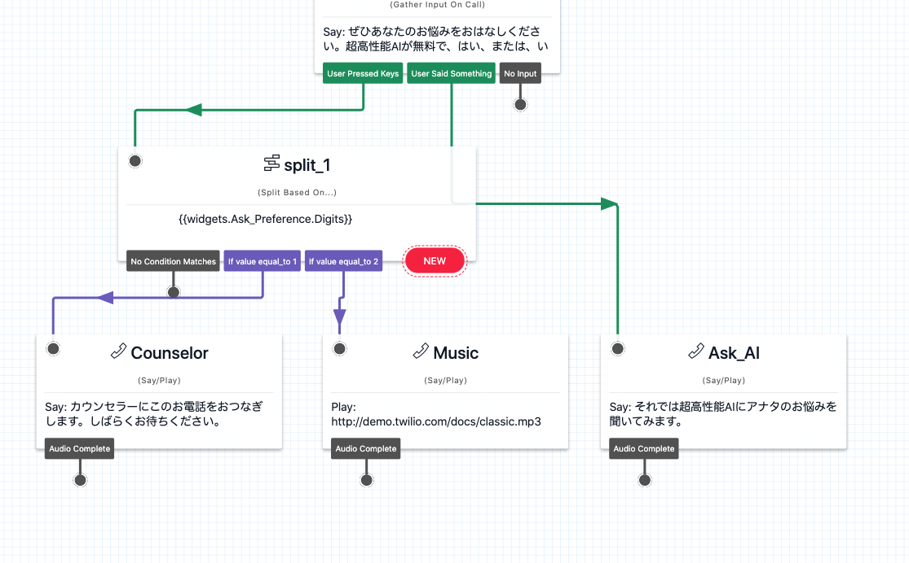

#  手順2: 分岐したフローをそれぞれ設定する

この手順では、`split_1`で分岐させたフローをそれぞれ設定します。

## 2-1. 各ウィジェットを追加する

`Say/Play`ウィジェットを新たに2つ追加し、それぞれ設定します。

### Say/Playウィジェット その1

> `split_1`ウィジェットの`If value equal_to 1`と接続。

|設定項目|値|
|:----|:----|
|WIDGET NAME| Counselor |
|TEXT TO SAY| カウンセラーにこのお電話をおつなぎします。しばらくお待ちください。|
|LANGUAGE|Japanese|
|MESSAGE VOICE| Alice、\[Polly\] Mizuki、\[Polly\] Takumiのいずれか|

### Say/Playウィジェット その2

> `split_1`ウィジェットの`If value equal_to 2`と接続。

|設定項目|値|
|:----|:----|
|WIDGET NAME| Music |
|SAY OR PLAY MESSAGE OR DIGITS|Play a Message|
|URL OF AUDIO FILE|http://demo.twilio.com/docs/classic.mp3|

ここまでのステップでデザインキャンバスは下記のようになっています。

ここでいったんフローをパブリッシュします。Twilio番号に電話をかけ、それぞれのオプションを確認しましょう。

## 関連リソース

- [Twilio CLI Quickstart](https://www.twilio.com/docs/twilio-cli/quickstart)

## 次のハンズオン
[ハンズオン: 超高性能AI（笑）に質問してみよう](/docs/03-Studio-Advanced-Features/00-Overview.md)