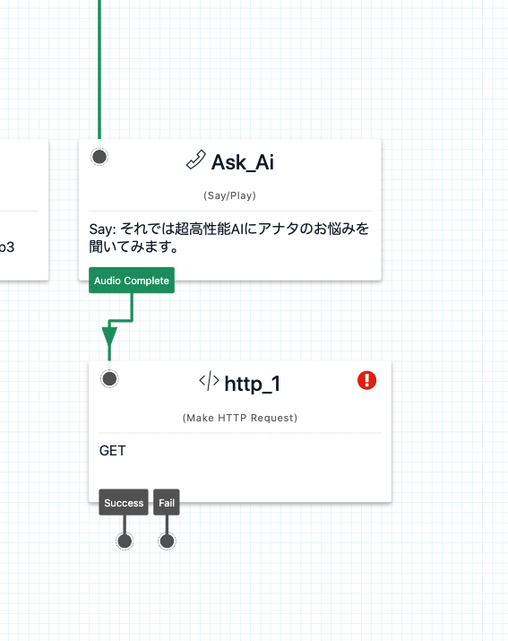
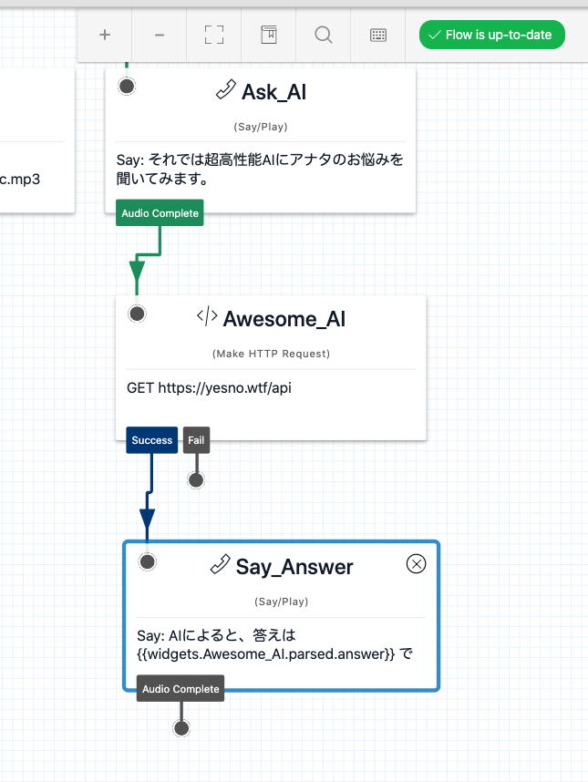

#  手順1: 外部サービスにリクエストを送信する

この手順では、外部サービスにフローからリクエストを発信し、値を取得する方法を学習します。

## 1-1. 外部サービスにリクエストを送信

`Make Http Request`ウィジェットを追加し、`Ask_AI`の`Audio Complete`に接続します。下記のスクリーンショットを参考にしてください。

追加したウィジェットの`Config`画面を設定します。

|設定項目|値|
|:----|:----|
|WIDGET NAME|Awesome_AI|
|REQUEST METHOD| GET|
|REQUEST URL|https://yesno.wtf/api|

## 1-2. リクエスト結果を使ってメッセージを再生

続けて`Say/Play`ウィジェットを追加し、`Awesome_AI`の`Success`と接続します。

ウィジェットの`Config`画面を設定します。

|設定項目|値|
|:----|:----|
|WIDGET NAME|Say_Answer|
|TEXT TO SAY| AIによると、答えは {{widgets.Awesome_AI.parsed.answer}} でした。ご参考になれば幸いです。|
|LANGUAGE|Japanese|
|MESSAGE VOICE| Alice、\[Polly\] Mizuki、\[Polly\] Takumiのいずれか|

ここまでの設定は下記のスクリーンショットになります。自分のキャンバスと見比べましょう。

-----

ここで利用されている記法は[Liquit Template Language](https://jp.twilio.com/docs/studio/user-guide/liquid-template-language)と呼ばれており、実行時に動的な値を設定できます。

-----

フローをパブリッシュし、超高性能AI（笑）に悩み事を相談してみましょう。

## 関連リソース

- [Twilio CLI Quickstart](https://www.twilio.com/docs/twilio-cli/quickstart)

## 次の手順
[手順2: カウンセラーに電話を転送する](02-Transfer-Call.md)
