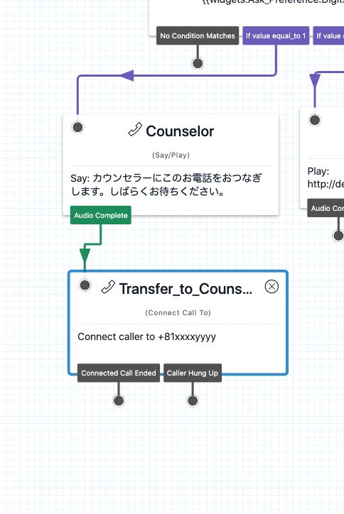
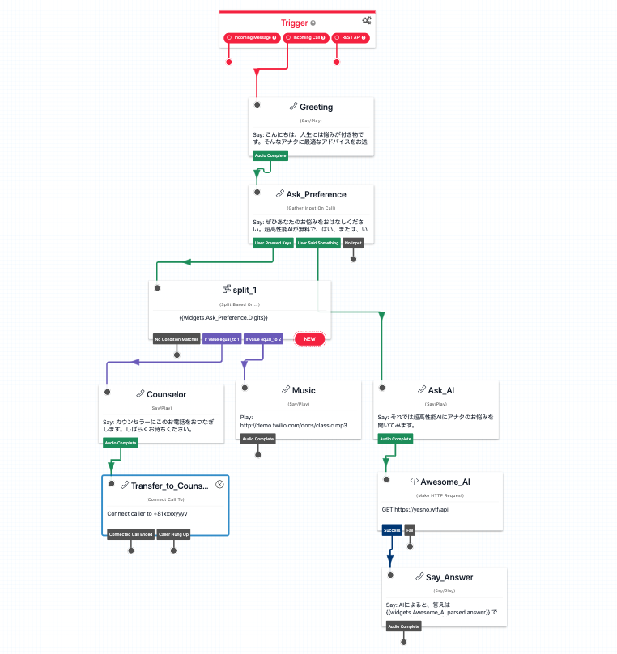

#  手順2: カウンセラーに電話を転送する

超高性能AI（笑）を実装できましたが、カウンセラーにはまだつながりません。この手順では、カウンセラーに電話を転送する方法を学習します。

## 2-1. 電話を転送する

`Connect Call to`ウィジェットを追加し`Counselor`の`Audio Complete`と接続します。

追加したウィジェットの`Config`画面の設定を下記のように行います。

|設定項目|値|
|:----|:----|
|WIDGET NAME|Transfer_to_Counselor|
|CONNECT CALL TO| Single Number 並びに自分の電話番号 （E.164フォーマットを使用、例:090-xxxx-yyyyの場合は、+8190xxxxyyyy)|
|CALLER ID|{{trigger.call.To}}|

すべてのフロー設定が完了した段階で再度パブリッシュし、カウンセラーに電話がつながることを確認しましょう。

これでハンズオンは終了です。お疲れさまでした。

全体フロー  

## 関連リソース

- [Twilio CLI Quickstart](https://www.twilio.com/docs/twilio-cli/quickstart)
